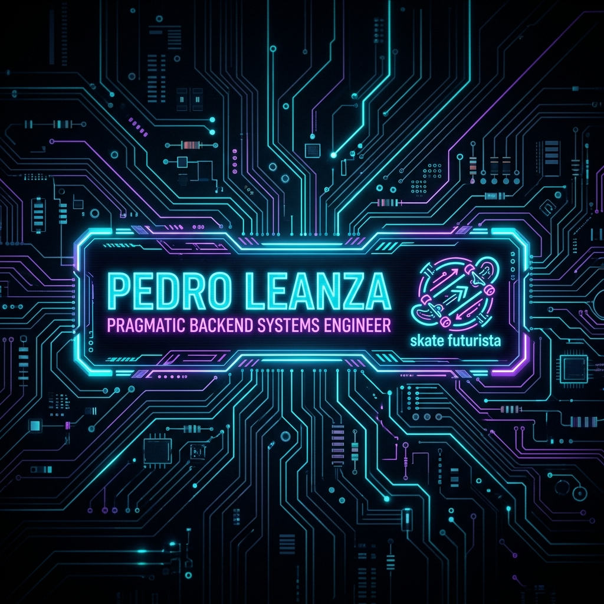
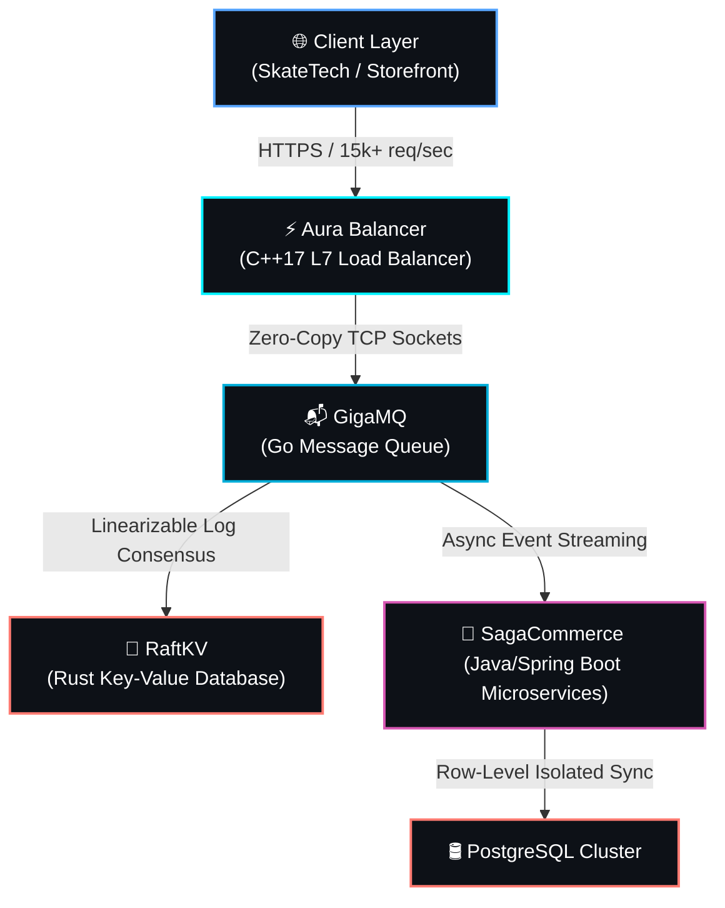

# Olá! Sou o Pedro Leanza 👋

  

  

---

### ⚡ Sobre Mim

Sou estudante de **Ciência da Computação (3º Semestre)** com foco absoluto em construir uma fundação técnica robusta. Minha abordagem de aprendizado é pragmática: recuso o superficialismo acadêmico tradicional e busco entender as engrenagens internas dos sistemas — concorrência, gerenciamento de memória, I/O e segurança de dados.

Minha rotina de engenharia divide-se em:
*   **🔬 Laboratórios de Sistemas & Fundamentos:** Onde desço ao nível do sistema operacional para entender e projetar sistemas distribuídos tolerantes a falhas.
*   **🚀 Desenvolvimento de Produtos & SaaS:** Onde implemento arquiteturas escaláveis, UX premium e integrações de alto valor comercial voltados ao mercado internacional.

---

### 🛠 Meu Arsenal Tecnológico

<table align="center" style="border: none; background: transparent;">
  <tr>
    <td align="left" valign="top" width="50%">
      <strong>Linguagens e Core</strong> 
      
      
       
      
      
    </td>
    <td align="left" valign="top" width="50%">
      <strong>Infraestrutura & Bancos</strong> 
      
      
       
      
      
    </td>
  </tr>
</table>

---

### 🗺️ Topologia de Sistemas Distribuídos

Em vez de acumular projetos soltos, eu desenho as minhas aplicações para operarem como peças conectadas de uma infraestrutura robusta de alta escala. O ecossistema abaixo ilustra como meus projetos se integram no fluxo de dados de um ambiente distribuído real:

---

### 💻 Simulador de Sistemas & Compilação

Para demonstrar a corretude e a performance real do meu código de baixo nível, o terminal interativo abaixo executa testes automatizados e benchmarks de desempenho dos meus serviços de backend:

  

---

### 🔬 Laboratórios de Backend (Fundamentos e Arquitetura)

Projetos desenvolvidos para estudar como arquiteturas complexas se comportam sob estresse, priorizando eficiência de CPU/memória e corretude técnica.

*   **[GigaMQ (Go)](https://github.com/Leanza-dev/GigaMQ)**: Message Broker TCP em memória projetado para altíssimo throughput. Utiliza buffers otimizados e paralelismo seguro via goroutines/channels para evitar alocações desnecessárias no Garbage Collector.
*   **[RaftKV (Rust)](https://github.com/Leanza-dev/RaftKV)**: Banco de dados Key-Value distribuído e tolerante a falhas, implementando o protocolo de consenso Raft. Focado em consistência forte ($Linearizability$) e tratamento rigoroso de concorrência com Rust `tokio`.
*   **[SagaCommerce (Java)](https://github.com/Leanza-dev/SagaCommerce)**: Sistema de e-commerce baseado em microsserviços aplicando o padrão **Saga Coreografada** com Spring Boot e Apache Kafka para garantir consistência eventual resiliente.
*   **[Aura Balancer (C++)](https://github.com/Leanza-dev/AuraBalancer)**: Balanceador de carga L7 minimalista e de alta performance implementado em C++17 puro com POSIX sockets, demonstrando controle fino sobre ponteiros e sincronização de concorrência via `std::atomic`.

---

### 🚀 Produtos & SaaS (Entrega de Valor e UX)

Aplicações modernas focadas em resolver problemas reais de mercado, unindo engenharia escalável a uma experiência de usuário polida.

*   **[Showroom Velocidade (Next.js)](https://github.com/Leanza-dev/ShowroomVelocidade)**: Plataforma *Website-as-a-Service* (WaaS) multi-tenant altamente otimizada para concessionárias. Foco em performance extrema (100/100 Lighthouse no mobile), SSG dinâmico e integração com funil de conversão no WhatsApp. *(Código Proprietário - Estudo de Caso Arquitetural no Repositório)*
*   **[SkateTech (React Native)](https://github.com/Leanza-dev/SkateTech)**: Aplicativo mobile para skatistas mapearem picos e compartilharem linhas. Foco em UX nativa fluida, geolocalização e transições fluidas de interface.
*   **[GigaCloud Infra (TypeScript)](https://github.com/Leanza-dev/GigaCloud)**: Estrutura serverless de referência com suporte a alta disponibilidade na AWS, focada em estratégias de aquecimento para prevenção de Cold Starts e observabilidade avançada.

---

### 📫 Conecte-se Comigo

*   **LinkedIn:** [linkedin.com/in/pedro-leanza](https://www.linkedin.com/in/pedro-leanza/)
*   **Email:** [pedro.leanza.dev@gmail.com](mailto:pedro.leanza.dev@gmail.com)
*   **Portfólio:** [pedroleanza.dev](https://pedroleanza.dev) *(Em breve atualizado com as novas animações e i18n)*

---
*“A complexidade é fácil. A simplicidade é que dá trabalho.”*
